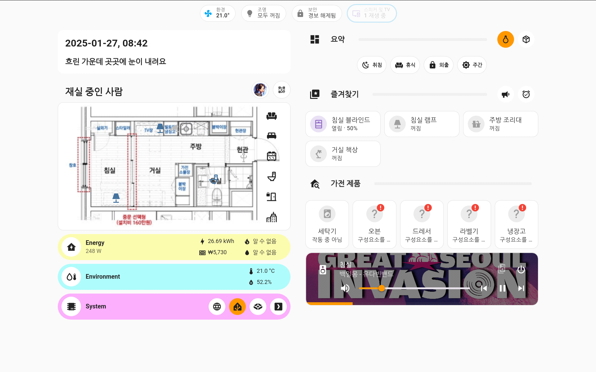

# Home Assistant Config

![Project Maintenance][maintenance-shield]
[![License][license-shield]](LICENSE)

[![GitHub Activity][commits-shield]][commits]
[![GitHub Last Commit][last-commit-shield]][commits]

![GitHub Stars][stars-shield]
![GitHub Watchers][watchers-shield]
![GitHub Forks][forks-shield]

This is my Home Assistant documentation, updated on 2025-02-14.

I used Home Assistant in 2018 and then migrated to Apple Home.

I started using Home Assistant again in 2022. Now, it has grown significantly, with a total of 1180 entities for now.

If you need more insights from my smart home other than auto generated document, Find below:

# Table of Content

[Screenshots](#screenshots) |
[Insights](#insights) |
[Software Integrations](#software-integrations) |
[Home Assistant Add-Ons](#home-assistant-add-ons) |
[Lovelace Dashboard](#lovelace-dashboard)

----

# Screenshots

<table>
  <tr>
    <td>
       
      Wall-Pad
    </td>
    <td>
       
      Power Distribution Panel
    </td>
    <td>
       
      Network and Server Rack
    </td>
  </tr>
  <tr>
    <td>
       
      Lovelace Dashboard
    </td>
    <td>
       
      Network Visualization
    </td>
    <td>
       
      Energy Dashboard
    </td>
  </tr>
</table>

# Insights

Domain | Value
-- | --
automations | 27
binary_sensors | 131
device_trackers | 7
lights | 10
media_players | 16
sensors | 721
switches | 35
switches | 35
others | 233
**Total** | **1180**

Component | Version
-- | --
Home Assistant Core | 2025.2.3
Supervisor | 2025.02.1
Operating System | 14.2

# Software Integrations

## Core Integrations

Integration | Configuration
--|--
 [17TRACK](https://home-assistant.io/integrations/seventeentrack) | Config flow[^1]
 [alert](https://home-assistant.io/integrations/alert) | [./packages/alerts_and_notifications.yaml](./packages/alerts_and_notifications.yaml)
 [Anthropic Conversation](https://home-assistant.io/integrations/anthropic) | Config flow[^1]
 [Apple iCloud](https://home-assistant.io/integrations/icloud) | Config flow[^1]
 [Apple TV](https://home-assistant.io/integrations/apple_tv) | Config flow[^1]
 [Automation](https://home-assistant.io/integrations/automation) | [./automations.yaml](./automations.yaml)
 [Bluetooth](https://home-assistant.io/integrations/bluetooth) | Config flow[^1]
 [CalDAV](https://home-assistant.io/integrations/caldav) | Config flow[^1]
 [Calendar](https://home-assistant.io/integrations/calendar) | Config flow[^1]
 [Certificate Expiry](https://home-assistant.io/integrations/cert_expiry) | Config flow[^1]
 [Command Line](https://home-assistant.io/integrations/command_line) | Config flow[^1]
 [Default Config](https://home-assistant.io/integrations/default_config) | [./configuration.yaml](./configuration.yaml)
 [Discord](https://home-assistant.io/integrations/discord) | Config flow[^1]
 [DOODS - Dedicated Open Object Detection Service](https://home-assistant.io/integrations/doods) | [./packages/doods_image_processing.yaml](./packages/doods_image_processing.yaml)
 [Electricity Maps](https://home-assistant.io/integrations/co2signal) | Config flow[^1]
 [ESPHome](https://home-assistant.io/integrations/esphome) | Config flow[^1]
 [Feedreader](https://home-assistant.io/integrations/feedreader) | Config flow[^1]
 [Frontend](https://home-assistant.io/integrations/frontend) | [./configuration.yaml](./configuration.yaml)
 [Fully Kiosk Browser](https://home-assistant.io/integrations/fully_kiosk) | Config flow[^1]
 [Generic Camera](https://home-assistant.io/integrations/generic) | Config flow[^1]
 [GitHub](https://home-assistant.io/integrations/github) | Config flow[^1]
 [Google Calendar](https://home-assistant.io/integrations/google) | Config flow[^1]
 [Google Drive](https://home-assistant.io/integrations/google_drive) | Config flow[^1]
 [Google Generative AI Conversation](https://home-assistant.io/integrations/google_generative_ai_conversation) | Config flow[^1]
 [Google Translate text-to-speech](https://home-assistant.io/integrations/google_translate) | Config flow[^1]
 [History](https://home-assistant.io/integrations/history) | Config flow[^1]
 [Holiday](https://home-assistant.io/integrations/holiday) | Config flow[^1]
 [Home Assistant Core Integration](https://home-assistant.io/integrations/homeassistant) | [./configuration.yaml](./configuration.yaml)
 [HTTP](https://home-assistant.io/integrations/http) | [./configuration.yaml](./configuration.yaml)
 [IMAP](https://home-assistant.io/integrations/imap) | [./packages/imap_content.yaml](./packages/imap_content.yaml)
 [Last.fm](https://home-assistant.io/integrations/lastfm) | Config flow[^1]
 [LG ThinQ](https://home-assistant.io/integrations/lg_thinq) | Config flow[^1]
 [Local Calendar](https://home-assistant.io/integrations/local_calendar) | Config flow[^1]
 [Local To Do](https://home-assistant.io/integrations/local_todo) | Config flow[^1]
 [Logger](https://home-assistant.io/integrations/logger) | [./configuration.yaml](./configuration.yaml)
 [Lovelace](https://home-assistant.io/integrations/lovelace) | [./ui-lovelace.yaml](./ui-lovelace.yaml)
 [Manual Alarm control panel](https://home-assistant.io/integrations/manual) | [./package/alarm_control_panel.yaml](./package/alarm_control_panel.yaml)
 [Matter (BETA)](https://home-assistant.io/integrations/matter) | Config flow[^1]
 [Mobile App](https://home-assistant.io/integrations/mobile_app) | Config flow[^1]
 [Moon](https://home-assistant.io/integrations/moon) | Config flow[^1]
 [MQTT](https://home-assistant.io/integrations/mqtt) | Config flow[^1]
 [Music Assistant](https://home-assistant.io/integrations/music_assistant) | Config flow[^1]
 [My Home Assistant](https://home-assistant.io/integrations/my) | [./configuration.yaml](./configuration.yaml)
 [notify](https://home-assistant.io/integrations/notify) | [./packages/alerts_and_notifications.yaml](./packages/alerts_and_notifications.yaml)
 [Open Thread Border Router](https://home-assistant.io/integrations/otbr) | Config flow[^1]
 [OpenAI Conversation](https://home-assistant.io/integrations/openai_conversation) | Config flow[^1]
 [Oral-B](https://home-assistant.io/integrations/oralb) | Config flow[^1]
 [Ping (ICMP)](https://home-assistant.io/integrations/ping) | Config flow[^1]
 [Plex Media Server](https://home-assistant.io/integrations/plex) | Config flow[^1]
 [Private BLE Device](https://home-assistant.io/integrations/private_ble_device) | Config flow[^1]
 [Profiler](https://home-assistant.io/integrations/profiler) | Config flow[^1]
 [Prometheus](https://home-assistant.io/integrations/prometheus) | [./configuration.yaml](./configuration.yaml)
 [Proximity](https://home-assistant.io/integrations/proximity) | Config flow[^1]
 [Recorder](https://home-assistant.io/integrations/recorder) | [./configuration.yaml](./configuration.yaml)
 [Scene](https://home-assistant.io/integrations/scene) | [./scenes.yaml](./scenes.yaml)
 [Script](https://home-assistant.io/integrations/script) | [./scripts.yaml](./scripts.yaml)
 [Season](https://home-assistant.io/integrations/season) | Config flow[^1]
 [Shell Command](https://home-assistant.io/integrations/shell_command) | [./configuration.yaml](./configuration.yaml)
 [SmartThings](https://home-assistant.io/integrations/smartthings) | Config flow[^1]
 [SQL](https://home-assistant.io/integrations/sql) | Config flow[^1]
 [Steam](https://home-assistant.io/integrations/steam_online) | Config flow[^1]
 [Sun](https://home-assistant.io/integrations/sun) | Config flow[^1]
 [Supervisor](https://home-assistant.io/integrations/hassio) | Config flow[^1]
 [System Monitor](https://home-assistant.io/integrations/systemmonitor) | Config flow[^1]
 [Template](https://home-assistant.io/integrations/template) | [./packages](./packages)
 [Thread](https://home-assistant.io/integrations/thread) | Config flow[^1]
 [Time & Date](https://home-assistant.io/integrations/time_date) | Config flow[^1]
 [Todoist](https://home-assistant.io/integrations/todoist) | Config flow[^1]
 [Uptime](https://home-assistant.io/integrations/uptime) | Config flow[^1]
 [Version](https://home-assistant.io/integrations/version) | Config flow[^1]
 [Withings](https://home-assistant.io/integrations/withings) | Config flow[^1]
 [Workday](https://home-assistant.io/integrations/workday) | Config flow[^1]
 [Wyoming](https://home-assistant.io/integrations/wyoming) | Config flow[^1]

## Custom Components from HACS

Name | Description
-- | --
 [[Kr] Gas Station Oil Price Sensor](https://github.com/GrecHouse/gas_station_korea) | Gas station oil price sensor #HA 주유소 유가 정보 센서
 [[Kr] Imazu Wall Pad](https://github.com/stkang/ha-component-imazu-wall-pad) | None
 [[Kr] Map Change Service](https://github.com/miumida/map_change) | Default Map to NAVER Map. Map Change Service for Home Assistant #HA
 [[KR] 전기요금 계산 센서 (가정용)](https://github.com/dugurs/kwh_to_won) | 한국전력 전기요금 계산기 (가정용)
 [Adaptive Lighting](https://github.com/basnijholt/adaptive-lighting) | Adaptive Lighting custom component for Home Assistant
 [Anniversaries](https://github.com/pinkywafer/Anniversaries) | Anniversary Countdown Sensor for Home Assistant
 [Discord Game](https://github.com/LordBoos/discord_game) | Home Assistant custom component to get online and game status of Discord users
 [E Commerce Price Tracker](https://github.com/hwajin-me/hs-price-tracker) | Home Assistant - E-commerce price tracker
 [Fireflyiii Integration](https://github.com/soloam/ha-fireflyiii-integration) | FireflyIII Integration for Home Assistant
 [Fontawesome](https://github.com/thomasloven/hass-fontawesome) | 🔹 Use icons from fontawesome in home-assistant
 [Generate Readme](https://github.com/custom-components/readme) | Use Jinja and data from Home Assistant to generate your README.md file
 [Grocy Custom Component](https://github.com/custom-components/grocy) | Custom Grocy integration for Home Assistant
 [HACS](https://github.com/hacs/integration) | HACS gives you a powerful UI to handle downloads of all your custom needs.
 [Hass Hue Icons Integration](https://github.com/arallsopp/hass-hue-icons-integration) | Additional vector icons for home assistant to model Philips Hue bulbs and fixtures. 
 [Ical Sensor](https://github.com/tybritten/ical-sensor-homeassistant) | an iCal Sensor for Home Assistant
 [Icloud3 V3 Idevice Tracker](https://github.com/gcobb321/icloud3) | iCloud3 v3, iDevice Tracker - An advanced iDevice tracker that uses Apple iCloud account and HA Mobile App data for presence detection and location based automations.
 [Lastfm Scrobbler](https://github.com/valentin-gosselin/lastfm-scrobbler-ha-integration) | An Home Assistant integration scrobble to last.fm
 [Life360](https://github.com/pnbruckner/ha-life360) | A Home Assistant integration for Life360.
 [Mediarr](https://github.com/Vansmak/mediarr_sensor) | None
 [Microsoft Edge Tts](https://github.com/hasscc/hass-edge-tts) | 🗣️ Microsoft Edge TTS for Home Assistant, no need for app_key
 [Scheduler Component](https://github.com/nielsfaber/scheduler-component) | Custom component for HA that enables the creation of scheduler entities
 [Simpleicons](https://github.com/vigonotion/hass-simpleicons) | Use Simple Icons in Home Assistant
 [Spook 👻 Your Homie](https://github.com/frenck/spook) | A scary 👻 powerful toolbox 🧰 for Home Assistant 🏡
 [Steam Wishlist](https://github.com/boralyl/steam-wishlist) | A home assistant integration that monitors games on sale on your Steam wishlist.
 [Thermal Comfort](https://github.com/dolezsa/thermal_comfort) | Thermal Comfort sensor for HA (absolute humidity, heat index, dew point, thermal perception)
 [Truenas](https://github.com/tomaae/homeassistant-truenas) | TrueNAS integration for Home Assistant 
 [Unifi Site Manager](https://github.com/domalab/ha-unifi-site-manager) | This integration allows you to monitor all UniFi sites from Home Assistant
 [버스(대중교통) 도착 정보](https://github.com/luiseok/ha-korea-bus-arrival) | Home Assistant custom component for South Korean bus arrival information
 [웨더뉴스 Weathernews](https://github.com/dugurs/ha-weathernews) | Home Assistant custom component/integration for Weathernews.com

# Home Assistant Add-Ons

I use Home Assistant as my main home server, so there are lots of add-ons. I could run Home Assistant as a VM on a dedicated VM server, but I prefer to keep things simple.

[Enterprise smart home syndrome](https://frenck.dev/the-enterprise-smart-home-syndrome/)

Name | Version | Description
-- | -- | --
Advanced SSH & Web Terminal | 20.0.0 | 
DOODS2 | 1 | 
ESPHome Device Builder | 2024.12.4 | 
File editor | 5.8.0 | 
Firefly III | dev | 
Grocy | 0.23.0 | 
HomeNetwork for Hillstate | 1.1.6 | 
iSponsorBlockTV add-on | 2.1.2 | 
Let's Encrypt | 5.2.12 | 
Mailserver | 3.0.1 | 
MariaDB | 2.7.2 | 
Matter Server | 7.0.0 | 
Mosquitto broker | 6.5.0 | 
MQTT Explorer | browser-1.0.1 | 
Music Assistant Server | 2.3.6 | 
NGINX Home Assistant SSL proxy | 3.11.1 | 
OpenThread Border Router | 2.13.0 | 
phpMyAdmin | 0.11.0 | 
Samba share | 12.4.0 | 
Studio Code Server | 5.18.1 | 
Victoria Metrics | 1.110.0 | 
Whisper | 2.4.0 | 
ytdlp2STRM | 1.0.0 | 

# Lovelace Dashboard
## Lovelace plugins

Name | Description
-- | --
[Apexcharts Card](https://github.com/RomRider/apexcharts-card) | 📈 A Lovelace card to display advanced graphs and charts based on ApexChartsJS for Home Assistant
[Atomic Calendar Revive](https://github.com/totaldebug/atomic-calendar-revive) | An advanced calendar card for Home Assistant Lovelace.
[Auto Entities](https://github.com/thomasloven/lovelace-auto-entities) | 🔹Automatically populate the entities-list of lovelace cards
[Bar Card](https://github.com/custom-cards/bar-card) | Customizable Animated Bar card for Home Assistant Lovelace
[Battery State Card / Entity Row](https://github.com/maxwroc/battery-state-card) | Battery state card for Home Assistant
[Bha Icon Pack](https://github.com/hulkhaugen/hass-bha-icons) | Additional icons for Home Assistant to accompany the MDI icons
[Bubble Card](https://github.com/Clooos/Bubble-Card) | Bubble Card is a minimalist card collection for Home Assistant with a nice pop-up touch.
[Button Card](https://github.com/custom-cards/button-card) | ❇️ Lovelace button-card for home assistant
[Card Mod](https://github.com/thomasloven/lovelace-card-mod) | 🔹 Add CSS styles to (almost) any lovelace card
[Custom Brand Icons](https://github.com/elax46/custom-brand-icons) | Custom brand icons for Home Assistant
[Custom Icons](https://github.com/Mariusthvdb/custom-icons) | Several custom made and legacy icons, and icons collected all over the internet in 1 set, UI selectable.
[Custom Icons Pack](https://github.com/MattFryer/Hass-Custom-Icons) | Additional icons for use in Home Assistant UI
[Energy Entity Row](https://github.com/zeronounours/lovelace-energy-entity-row) | Lovelace HA entity row to integrate with energy-date-selection
[Energy Flow Card Plus](https://github.com/flixlix/energy-flow-card-plus) | An upgraded Energy Distribution Card for Home Assistant, with added features like Individual Devices and refined UI enhancements, while maintaining the Energy Dashboard's original design.
[Expander Card](https://github.com/MelleD/lovelace-expander-card) | Expander card for HomeAssistant
[Grocy Tasks And Chores Card](https://github.com/FamousWolf/grocy-tasks-chores) | Custom Home Assistant card for displaying tasks and chores from Grocy. This card requires the custom Grocy integration to be installed in Home Assistant.
[Ha Map Card Korea Radar](https://github.com/hwajin-me/ha-map-card-korea-radar) | Integrates a Korea rain radar overlay in the Home Assistant custom map card
[Hass Hue Icons](https://github.com/arallsopp/hass-hue-icons) | Additional vector icons for home assistant to model Philips  Hue bulbs and fixtures. 
[Hui Element](https://github.com/thomasloven/lovelace-hui-element) | 🔹 Use built-in elements in the wrong place
[Kiosk Mode](https://github.com/NemesisRE/kiosk-mode) | 🙈 Hides the Home Assistant header and/or sidebar
[Layout Card](https://github.com/thomasloven/lovelace-layout-card) | 🔹 Get more control over the placement of lovelace cards.
[List Card](https://github.com/iantrich/list-card) | 📰 Display sensor list data in a table
[Logbook Card](https://github.com/royto/logbook-card) | Logbook card for Home Assistant UI Lovelace
[Lovelace Grocy Chores Card](https://github.com/isabellaalstrom/lovelace-grocy-chores-card) | A card to track chores and tasks in Grocy.
[Lovelace Home Feed Card](https://github.com/gadgetchnnel/lovelace-home-feed-card) | A custom Lovelace card for displaying a combination of persistent notifications, calendar events, and entities in the style of a feed.
[Map Card](https://github.com/nathan-gs/ha-map-card) | A Map Card for Home Assistant
[Meal Plan Card   Lovelace Style](https://github.com/firstof9/lovelace-grocy-meal-plan-card) | Meal Plan Card for Home Assistant Grocy integration
[Mediarr Card](https://github.com/Vansmak/mediarr_card) | custom sonarr component for home assistant
[Mini Graph Card](https://github.com/kalkih/mini-graph-card) | Minimalistic graph card for Home Assistant Lovelace UI
[Mini Media Player](https://github.com/kalkih/mini-media-player) | Minimalistic media card for Home Assistant Lovelace UI
[More Info Card](https://github.com/thomasloven/lovelace-more-info-card) | 🔹 Display the more-info dialog of any entity as a lovelace card
[Multiple Entity Row](https://github.com/benct/lovelace-multiple-entity-row) | Show multiple entity states and attributes on entity rows in Home Assistant's Lovelace UI
[Mushroom](https://github.com/piitaya/lovelace-mushroom) | Build a beautiful Home Assistant dashboard easily
[Nintendo Wishlist Card](https://github.com/custom-cards/nintendo-wishlist-card) | Displays a card showing Nintendo Switch games that are on sale from your wish list.
[Notify Card](https://github.com/bernikr/lovelace-notify-card) | Send notifications directly from the dashboard
[Scheduler Card](https://github.com/nielsfaber/scheduler-card) | HA Lovelace card for control of scheduler entities
[Stack In Card](https://github.com/custom-cards/stack-in-card) | 🛠 group multiple cards into one card without the borders
[Steam Card](https://github.com/mkanet/kb-steam-card-plus) | An enhanced version of the Steam card with builtin support for current custom Roblox integration
[Tabbed Card](https://github.com/kinghat/tabbed-card) | a custom card for home assistant that utilizes tabs to segregate individual cards.
[Template Entity Row](https://github.com/thomasloven/lovelace-template-entity-row) | 🔹 Display whatever you want in an entities card row.
[Thermal Comfort Icons](https://github.com/rautesamtr/thermal_comfort_icons) | Thermal Comfort custom icons for Home Assistant to accompany the MDI icons

## Themes

Name | Description
-- | --
[Visionos Theme](https://github.com/Nezz/homeassistant-visionos-theme) | Theme inspired by visionOS for Home Assistant

***

Generated by the [custom readme integration](https://github.com/custom-components/readme)

Huge Thanks to [Joris Roovers](https://github.com/jorisroovers), this work is heavily influenced by his [work](https://github.com/jorisroovers/casa)

<!-- Footnotes -->
[^1]: UI Configuration

[commits-shield]: https://img.shields.io/github/commit-activity/y/saya6k/hass-config.svg
[commits]: https://github.com/saya6k/hass-config/commits/master
[contributors]: https://github.com/saya6k/hass-config/graphs/contributors
[saya6k]: https://github.com/saya6k
[home-assistant]: https://home-assistant.io
[issue]: https://github.com/saya6k/hass-config/issues
[license-shield]: https://img.shields.io/github/license/saya6k/hass-config.svg
[maintenance-shield]: https://img.shields.io/maintenance/yes/2025.svg
[last-commit-shield]: https://img.shields.io/github/last-commit/saya6k/hass-config.svg
[stars-shield]: https://img.shields.io/github/stars/saya6k/hass-config.svg?style=social&label=Stars
[forks-shield]: https://img.shields.io/github/forks/saya6k/hass-config.svg?style=social&label=Forks
[watchers-shield]: https://img.shields.io/github/watchers/saya6k/hass-config.svg?style=social&label=Watchers